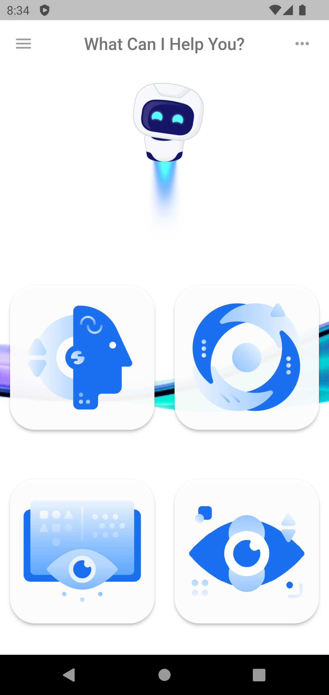

# google_ml_vision_template

## What Is This Template?

- This template is for Blueinno Flutter Course (411) L5
- This template is used for developing with Google's ML Vision Kit ([Official](https://developers.google.com/ml-kit)) ([Flutter package](https://pub.dev/packages/google_ml_vision))

 

## What's Inside This Template?

1. Empty main screen with pre-defined routes
2. Four simple sub-screens, each match to corresponding function in ML Vision Kit
3. Some nice image files (find them in **images folder**)

 

## Your Tasks:

1. Check if you have any testable devices
   - If (Android devices + Windows/Mac):
     - Android version >= Lollipop
     - Enabled Deverloper setting on your device
     - Install Android Studio
   - Else if (IOS devices + Mac):
     - IOS version >= 12.0
     - Install XCode
     - Apple ID
   - Else:
     - Install Android Studio
     - Install [Android emulator with Google Play Service](https://docs.google.com/document/d/16fZHt2-mdBddeG_GikYGYv8APt7H_TJ5AzY6PCdfyxI/edit#heading=h.5ybe1c7oezk3)

    
   
2. Run this template and resolve any build errors
   - Resolve [Android build error](https://docs.google.com/document/d/1aKLDsIZwWI3PU6sZ2pQgRAAkxOwSt78lTMFGbHsF7Mg/edit#heading=h.856lrm8rqmlw)
   - Resolve IOS build error:
     - [Sign in XCode with Apple ID ](https://docs.google.com/document/d/1o-oaqv_ejQaDblm-a8ZSbklUppd3OwKI8AuI6-MOXBs/edit#heading=h.lyfuzg1krrj5)
     - [Build error](https://docs.google.com/document/d/1o-oaqv_ejQaDblm-a8ZSbklUppd3OwKI8AuI6-MOXBs/edit#heading=h.x95b8xw8g9e4)

 

3. Create the menu layout, example:

   

 

4. Use the pre-defined routes and navigate to other screens upon press events

 

5. Install relevant packages and implement face detection
   - [image_picker](https://pub.dev/packages/image_picker)
   - [google_ml_vision](https://pub.dev/packages/google_ml_vision)

 

6. Draw the bounding boxes (maybe difficult)
   - Require [image](https://pub.dev/packages/image) package to process image files
   - Require [path_provider](https://pub.dev/packages/path_provider) package
   - Require [CustomPaint](https://api.flutter.dev/flutter/widgets/CustomPaint-class.html)

 

7. Assignment/Exercise

   - Polish the app appearance
   - Implement the other 3 functions in Google's ML Vision
